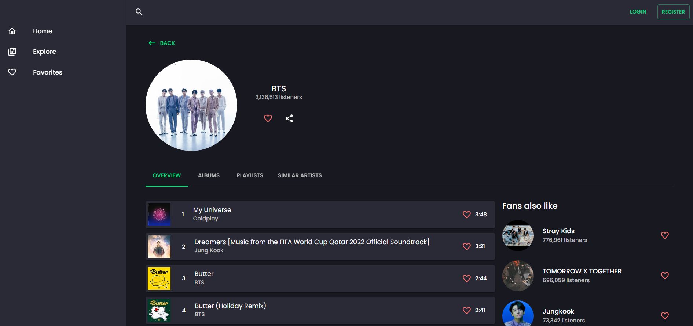

### Links

- Live Site URL: [https://react-music-app-bb.netlify.app/](https://react-music-app-bb.netlify.app/)

### Screenshot

### About the application

Users should be able to:

- View the optimal layout for the site depending on their device's screen size
- See hover and active states for all interactive elements on the page
- Select artists by genre
- See Home page, Explore page, Artist Page, Album Page, Playlist Page
- Register and login, then add artists, playlists, albums and songs to favorites, update the profile page
- Play a song, see the audio player with all the features included
- Audio player with song info, controls (play, pause, next, previous, volume, progression of the track), queue (with the playlist)
- Back-end for register, login, update profile and add to favorites
- When the user is logged in, user can add artists, playlists, albums and songs to favorites.

### Built with

- React
- TypeScript
- Material UI
- Redux Toolkit
- React-router-dom
- Classnames
- Swiper
- Deezer API
- Express js
- MongoDB
- Mongoose

### Backend 
- Repository: [https://github.com/BiancaGlavan/music-app-backend](https://github.com/BiancaGlavan/music-app-backend)
